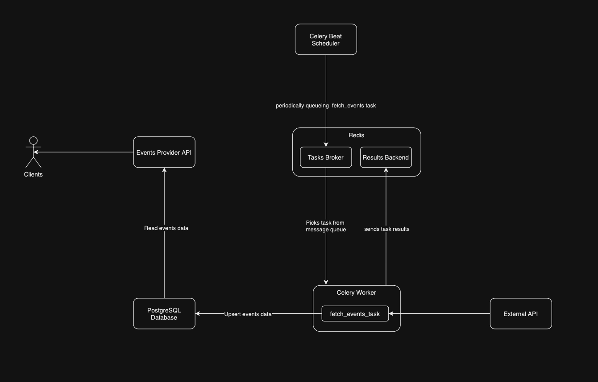

# External Providers API

This project is a microservice that integrates with an external events provider (XML) and returns the events that were historically or currently online within a given time range.




## Table of contents

- [Project overview](#project-overview)
- [Prerequisites](#prerequisites)
- [Running the project](#running-the-project)
- [API documentation](#api-documentation)
- [API ad-hoc testing](#api-ad-hoc-testing)
- [Measure API response time](#measure-api-response-time)
- [Running the tests](#running-the-tests)
- [Running a task](#running-a-task)
- [Stopping the project](#stopping-the-project)
- [Development work](#development-work)
- [Future improvements](#future-improvements)

## Project overview

The project is a FastAPI application that integrates with an external events provider and returns the events within a given time range.

## Prerequisites

Ensure you have the following installed:

- [Docker](https://www.docker.com/get-started)
- [Docker Compose](https://docs.docker.com/compose/install/)
- [Make](https://www.gnu.org/software/make/)

## Running the project

You can start the project with the following command:

```bash
make run
```

## API documentation

The API documentation is available at `http://localhost:8000/docs`.

## API ad-hoc testing

You can test the API using the `curl` command. For example, to get the events within a given time range, you can use the following command:

```bash
curl -X GET "http://localhost:8000/search?starts_at=2021-01-01T00:00:00Z&ends_at=2021-12-31T23:59:59Z"
```

## Measure API response time

To ad-hoc measure the API response time, you can use the following command:

```bash
curl -X GET "http://localhost:8000/search?starts_at=2021-01-01T00:00:00&ends_at=2021-12-31T23:59:59Z" \
-H "accept: application/json" \
-w "\nTotal time: %{time_total}s\n"
```

During development, the most performant response time seen was `0.004573s`:

```bash
➜  ~ curl -X GET "http://localhost:8000/search?starts_at=2021-01-01T00:00:00&ends_at=2021-12-31T23:59:55Z" \
-H "accept: application/json" \
-w "\nTotal time: %{time_total}s\n"
Total time: 0.004573s
```

## Running the tests

To run the tests, you can use the following command:

```bash
make test
```

## Running a task

To run an external provider event fetching task, you can use the following command:

```bash
make run-task
```

## Stopping the project

To stop the project without removing containers, you can use the following command:

```bash
make stop
```

To stop the project and remove containers, you can use the following command:

```bash
make down
```

To restart the project, you can use the following command:

```bash
make restart
```

## Development work

Install pre-commit hooks:

```bash
pre-commit install
```

Install project dependencies:

```bash
poetry install
```

## Future improvements

- CI/CD pipeline: Implement a CI/CD pipeline to automatically build, test, and deploy the project.
- Environments: Implement a multi-environment setup (dev, testing, staging, production) with different configuration for each environment.
- Implement Caching: Utilize Redis to cache frequent search queries, enhancing performance.
- Data Retention Policies: Introduce mechanisms to archive or delete outdated events to manage database size.
- Advanced logging: Add structured and centralized logging to the project.
- Advanced Monitoring: Integrate tools like Prometheus and Grafana for real-time monitoring and alerting.
- Enhanced Security: Implement authentication and authorization for API endpoints.
- Scalability Enhancements: Optimize Celery task management and consider deploying services using Kubernetes for better scalability.
